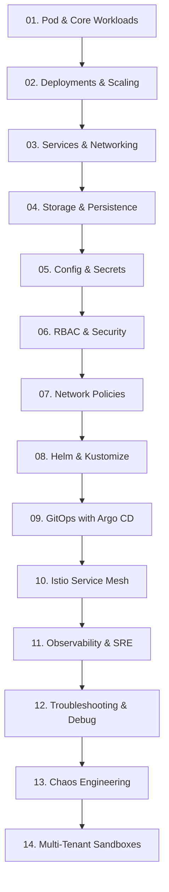

# KubeLab — Comprehensive Curriculum Matrix

## 1. 14 Learning Tracks Overview

---

## 2. Track & Module Summary

1. **Pod & Core Workloads (12 Labs)**: Pod anatomy, init containers, probes, multi-container pods.
2. **Deployments & Scaling (10 Labs)**: Rolling updates, canary, blue-green, HPA, scaling policies.
3. **Services & Networking (12 Labs)**: ClusterIP, NodePort, LoadBalancer, CoreDNS, Ingress.
4. **Storage & Persistence (10 Labs)**: PV, PVC, StorageClass, CSI drivers, StatefulSets.
5. **Config & Secrets (10 Labs)**: ConfigMaps, Secrets, immutable configs, environment projection.
6. **RBAC & Security (12 Labs)**: Roles, RoleBindings, ClusterRoles, ServiceAccounts, PSS.
7. **Network Policies (10 Labs)**: Ingress/egress rules, default-deny, CIDR filtering.
8. **Helm & Kustomize (10 Labs)**: Chart creation, templates, values override, Kustomize bases & overlays.
9. **GitOps with Argo CD (10 Labs)**: Declarative apps, automated sync, drift correction, rollback.
10. **Istio Service Mesh (10 Labs)**: mTLS enforcement, VirtualService, DestinationRule, fault injection.
11. **Observability & SRE (10 Labs)**: Prometheus metrics, OTel tracing, log aggregation, Grafana.
12. **Troubleshooting & Debug (12 Labs)**: CrashLoopBackOff, ImagePullBackOff, node cordon/drain, OOM.
13. **Chaos Engineering (8 Labs)**: Pod killer, network latency injection, pod churn resilience.
14. **Multi-Tenant Sandboxes (9 Labs)**: Resource quotas, LimitRanges, tenant network isolation.
