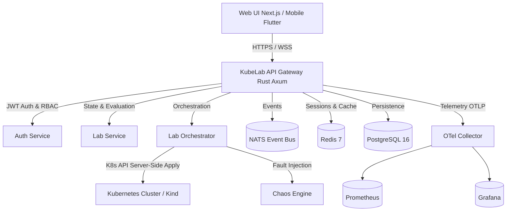

# KubeLab — Comprehensive Product Specification

## 1. Product Vision & Overview
KubeLab is a zero-trust, enterprise-grade, browser-accessible Kubernetes and Cloud-Native interactive engineering platform designed for engineers, SREs, platform teams, and DevOps practitioners. It provides real disposable sandboxes, live state evaluation, interactive web terminals, GitOps workflows, service mesh integration, incident response simulation, and automated deterministic skill verification.

---

## 2. Core Personas
- **Learner / Cloud Engineer**: Follows guided curriculum, launches disposable sandboxes, writes and applies YAML manifests via Monaco, debugs pods via terminal, receives instant deterministic feedback.
- **Instructor / Curriculum Author**: Designs declarative lab YAML definitions, sets resource constraints, authors multi-stage break-fix incident scenarios.
- **Platform Administrator / SRE**: Manages cluster lifecycle, monitors system health (OTel, Prometheus, Grafana), audits access controls, enforces zero-trust boundaries.

---

## 3. Architecture & High-Level Components

---

## 4. Key Functional Capabilities

### 4.1. Declarative Lab Engine & Evaluator
- 14 Curriculum tracks, 145 declarative YAML lab definitions.
- Deterministic state-based validation via JSONPath assertion evaluation against live Kubernetes objects.
- Multi-step tasks, hints with score penalties, solution walkthroughs.

### 4.2. Zero-Trust Sandbox Isolation
- Disposable namespace provisioning per session with automated TTL expiration.
- Pod Security Standards (PSS) Restricted enforcement.
- Hard resource quotas: CPU, memory, pods, services.
- Default-deny network policies preventing cross-tenant and control-plane traversal.

### 4.3. Interactive Terminal & Code Editor
- Monaco YAML editor with server-side validation and namespace-scoped server-side apply.
- Interactive xterm.js terminal over authenticated WebSocket tunnels.

### 4.4. GitOps & Service Mesh
- Argo CD application status, drift detection, and auto-sync evaluation.
- Istio service mesh traffic routing, mTLS validation, and canary deployments.

### 4.5. AI Tutor & Socratic Assistance
- 5 contextual assistance modes: Explain, Socratic, Hint, Diagnose, Review.
- Deterministic validator remains authoritative; AI never bypasses test assertions.

---

## 5. Non-Functional Requirements & SLOs
- **Availability**: 99.9% uptime target for API gateway and backing services.
- **Sandbox Startup Latency**: p95 < 2.5s for disposable namespace provisioning.
- **Evaluation Latency**: p95 < 350ms for live JSONPath state inspection.
- **Zero Host Installation**: Everything runnable via container technology with zero host pollution.
