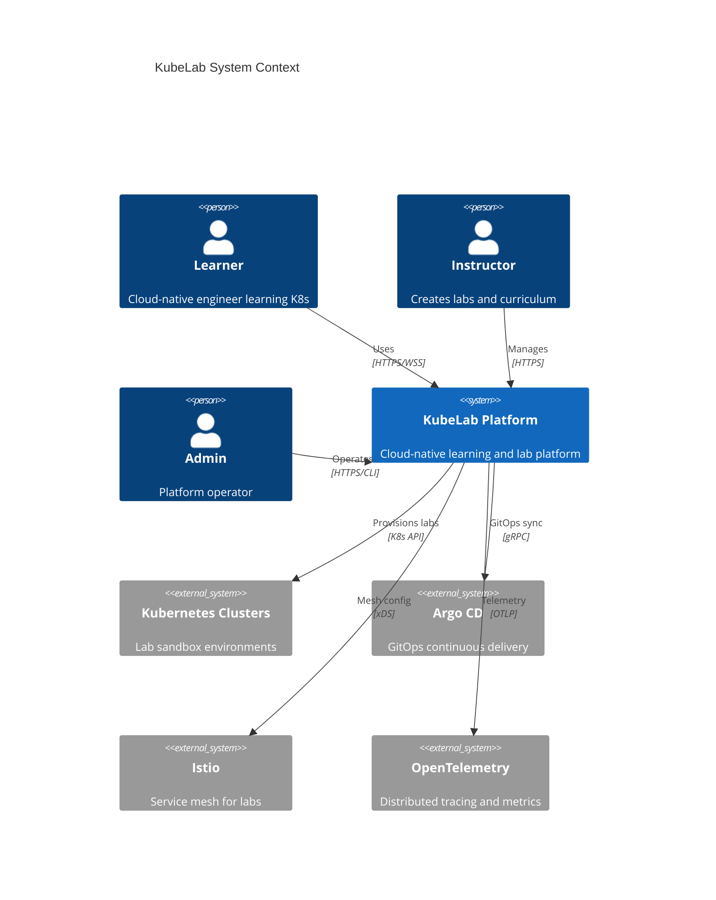
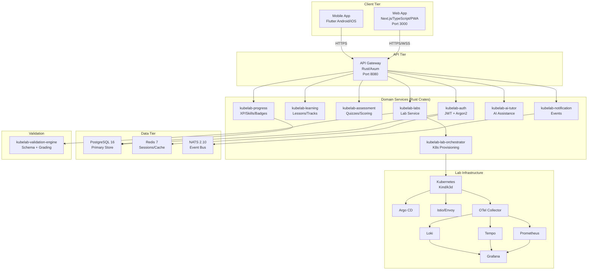
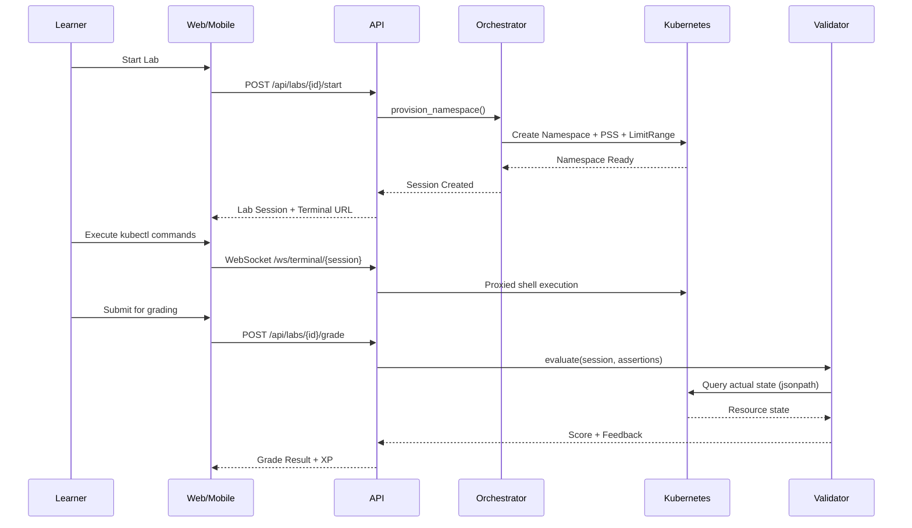
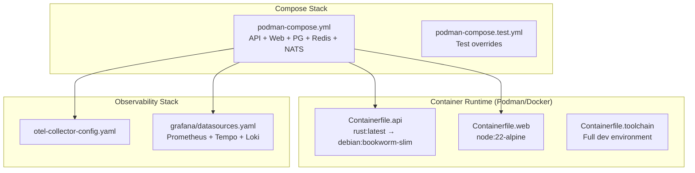

# KubeLab Architecture

## System Context

## Container Diagram

## Component Responsibilities

### API Gateway (`services/api`)
- HTTP/WebSocket routing via Axum
- JWT authentication middleware
- CORS, rate limiting, request validation
- Terminal WebSocket proxy with sandbox isolation
- OpenAPI/Swagger documentation
- Health checks and Prometheus metrics endpoint

### Auth Service (`services/auth`)
- User registration with Argon2 password hashing
- JWT token generation and validation
- Role-based access control (Learner, Instructor, Admin)
- Session management via Redis

### Lab Orchestrator (`services/lab-orchestrator`)
- Kubernetes namespace provisioning with PSS `restricted` profiles
- LimitRange enforcement and resource quotas
- IMDS metadata blocking via NetworkPolicy
- Chaos injection for incident simulation
- Manifest application and cleanup

### Validation Engine (`packages/validation-engine`)
- Declarative lab schema definition and parsing
- State-based grading via Kubernetes API assertions
- JSONPath field extraction and comparison
- Support for 154 lab definitions across 15 tracks

## Data Flow: Lab Lifecycle

## Deployment Architecture

## Network & Port Map

| Service | Port | Protocol | Description |
|---|---|---|---|
| Web App | 3000 | HTTP | Next.js frontend |
| API | 8080 | HTTP/WS | Axum REST + WebSocket |
| PostgreSQL | 5432 | TCP | Primary database |
| Redis | 6379 | TCP | Session cache |
| NATS | 4222 | TCP | Event bus |
| NATS Monitor | 8222 | HTTP | NATS monitoring |
| Prometheus | 9090 | HTTP | Metrics |
| Grafana | 3001 | HTTP | Dashboards |
| Tempo | 4317 | gRPC | Traces (OTLP) |
| Loki | 3100 | HTTP | Logs |
| OTel Collector | 4318 | HTTP | Telemetry ingestion |

## Security Boundaries

- **API perimeter**: All external traffic terminates at the Axum API gateway with JWT validation
- **Lab isolation**: Each learner gets a dedicated Kubernetes namespace with PSS `restricted`, LimitRange, and IMDS-blocking NetworkPolicy
- **Terminal sandbox**: WebSocket terminal sessions run in isolated shell processes with environment sanitization and 30-minute idle timeout
- **Container runtime**: All containers run as non-root users with dropped capabilities
- **Admission control**: Server-side YAML admission rejects privileged pods, hostNetwork, hostPath, runtime socket mounts, and cluster-admin bindings
