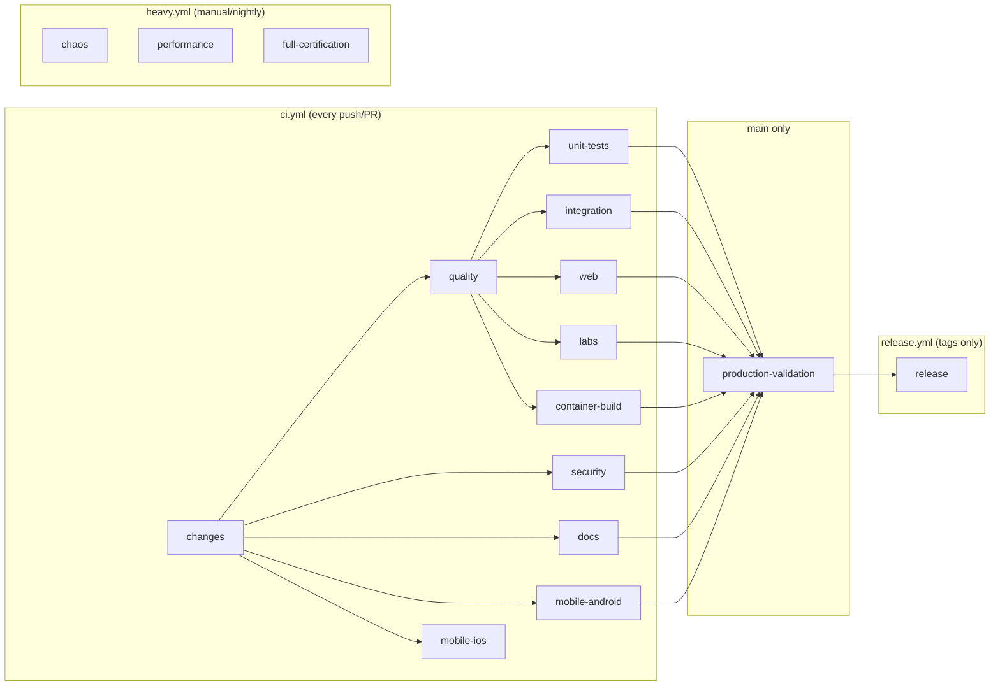

# KubeLab CI/CD

## Pipeline Architecture

KubeLab uses a single CI orchestrator (`ci.yml`) with change detection, eliminating redundant builds.



## Workflow Files

| File | Trigger | Purpose |
|---|---|---|
| `ci.yml` | push/PR to main | Primary CI orchestrator with all jobs |
| `release.yml` | tag `v*.*.*` | Download CI artifacts + create GitHub Release |
| `heavy.yml` | manual/nightly schedule | Chaos, performance, full certification |

## Change Detection

Uses `dorny/paths-filter@v3` to determine affected areas:
- **backend**: `services/**`, `packages/validation-engine/**`, `Cargo.*`
- **web**: `apps/web/**`, `packages/ui/**`, `packages/shared-types/**`
- **mobile**: `apps/mobile/**`
- **docs**: `docs/**`, `*.md`
- **labs**: `labs/**`, `packages/validation-engine/**`
- **infra**: `infrastructure/**`, `.github/workflows/**`

## Caching

| Cache | Tool | Key |
|---|---|---|
| Cargo dependencies | `Swatinem/rust-cache@v2` | `Cargo.lock` hash |
| pnpm dependencies | `actions/setup-node` cache | `pnpm-lock.yaml` |
| Flutter SDK | `subosito/flutter-action` cache | Flutter channel |

## Artifacts

| Artifact | Produced By | Retention |
|---|---|---|
| `kubelab-android-<sha>-apk` | mobile-android | 30 days |
| `kubelab-android-<sha>-aab` | mobile-android | 30 days |
| `mobile-coverage` | mobile-android | 14 days |
| `container-sboms` | container-build | 30 days |

## Troubleshooting CI

### Where are artifacts?
Go to the CI run → click on the job → **Artifacts** section at the bottom.

### How to rerun a failed job?
Click **Re-run failed jobs** in the GitHub Actions UI.

### How to reproduce CI locally?
```bash
# Backend
cargo fmt --all -- --check
cargo clippy --workspace --all-targets -- -D warnings
cargo test --workspace

# Web
pnpm install --frozen-lockfile=false
pnpm --filter @kubelab/web build

# Mobile
cd apps/mobile && flutter analyze && flutter test && flutter build apk --release
```

### Common failures
| Symptom | Cause | Fix |
|---|---|---|
| `cargo fmt` diff | Unformatted code | Run `cargo fmt --all` locally |
| `clippy` warnings | Lint violations | Fix the warning or add targeted `#[allow]` |
| Missing `pnpm-lock.yaml` | Cache expects lockfile | Remove `cache: 'pnpm'` or generate lockfile |
| `edition2024` error | Old Rust version in container | Use `rust:latest` in Containerfile |
| Flutter `deprecated_member_use` | Using deprecated Flutter APIs | Update to recommended alternatives |

### How to perform a release
1. Ensure CI passes on main
2. Create and push a version tag: `git tag v1.2.0 && git push origin v1.2.0`
3. `release.yml` triggers automatically
4. APK/AAB artifacts are downloaded from the CI run and attached to the release
