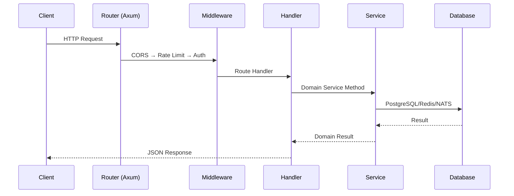

# KubeLab Code Understanding

## Repository Structure

```
kubelab/
├── apps/
│   ├── web/                    # Next.js TypeScript PWA frontend
│   │   ├── src/app/            # App router pages and layouts
│   │   ├── src/components/     # React UI components
│   │   ├── e2e/                # Playwright E2E test specs
│   │   ├── public/             # Static assets, PWA service worker
│   │   └── playwright.config.ts
│   └── mobile/                 # Flutter companion app
│       ├── lib/screens/        # Dart screen widgets
│       ├── android/            # Android build configuration
│       ├── ios/                # iOS build configuration
│       └── test/               # Widget and navigation tests
├── services/                   # Rust backend microservices (Cargo workspace)
│   ├── api/                    # HTTP/WebSocket gateway (Axum)
│   │   ├── src/routes/         # Route handlers (auth, labs, terminal_ws, etc.)
│   │   ├── src/db/             # Database access layer
│   │   ├── src/cache/          # Redis session store
│   │   ├── src/events/         # NATS event publishing
│   │   ├── src/admission.rs    # Server-side YAML admission controller
│   │   ├── src/metrics.rs      # Prometheus metrics endpoint
│   │   ├── src/telemetry.rs    # OpenTelemetry tracing setup
│   │   ├── migrations/         # SQL migration files
│   │   └── tests/              # Integration and contract tests
│   ├── auth/                   # JWT authentication + Argon2 password hashing
│   ├── learning/               # Lesson and track content service
│   ├── assessment/             # Quiz and scoring engine
│   ├── progress/               # XP, skill graph, badge tracking
│   ├── labs/                   # Lab session management + GitOps evaluator
│   ├── lab-orchestrator/       # Kubernetes namespace provisioning + chaos
│   ├── ai-tutor/               # AI-powered learning assistance
│   └── notification/           # Event-driven notification service
├── packages/                   # Shared libraries
│   ├── validation-engine/      # Declarative lab schema validation + grading (Rust)
│   ├── shared-types/           # TypeScript shared type definitions
│   ├── ui/                     # React UI component library
│   ├── curriculum/             # Curriculum data and utilities
│   └── lab-sdk/                # Lab authoring SDK
├── labs/                       # 145 declarative lab definitions (YAML)
├── infrastructure/
│   ├── containers/             # Containerfiles + compose definitions
│   ├── gitops/                 # ArgoCD application manifests
│   ├── kind/                   # Kind cluster configurations
│   └── mesh/                   # Istio/Envoy service mesh manifests
├── scripts/                    # Automation scripts (PowerShell + Bash)
├── docs/                       # Documentation
└── Cargo.toml                  # Rust workspace root
```

## Service Entry Points

| Service | Entry Point | Listening |
|---|---|---|
| API Gateway | `services/api/src/main.rs` | `0.0.0.0:8080` |
| Auth | Library crate, consumed by API | — |
| Learning | Library crate, consumed by API | — |
| Assessment | Library crate, consumed by API | — |
| Progress | Library crate, consumed by API | — |
| Labs | Library crate, consumed by API | — |
| Lab Orchestrator | Library crate, consumed by Labs | — |
| AI Tutor | Library crate, consumed by API | — |
| Notification | Library crate, consumed by API | — |
| Validation Engine | Library + CLI binaries | — |

## Request Flow



## Authentication Flow

1. `POST /api/auth/register` → `auth::register()` → Argon2 hash → PostgreSQL insert → JWT token
2. `POST /api/auth/login` → `auth::login()` → Argon2 verify → JWT token + Redis session
3. Subsequent requests: `Authorization: Bearer <jwt>` → middleware extracts claims → `claims.sub` = user ID
4. WebSocket: Token validated on upgrade handshake → session ownership verified → terminal spawned

## Terminal WebSocket Flow

1. Client connects to `/ws/terminal/{session_id}` with JWT
2. Server validates JWT, checks Redis session revocation, verifies `claims.sub == session.user_id`
3. Sandboxed shell process spawned with sanitized environment (non-root)
4. Bidirectional WebSocket relay: client keystrokes → shell stdin, shell stdout → client
5. 30-minute inactivity timeout auto-disconnects

## Lab Grading Flow

1. Learner submits lab → `POST /api/labs/{id}/grade`
2. Labs service loads `DeclarativeLabDef` from `labs/` YAML
3. For each `StateAssertion`: query Kubernetes API via JSONPath
4. Compare actual value against expected using `ValidationOperator` (Equals, Contains, Exists, etc.)
5. Aggregate task scores → total score → XP awarded → skill graph updated

## Database Model

Key tables in `services/api/migrations/0001_init.sql`:

| Table | Purpose |
|---|---|
| `users` | User accounts with hashed passwords and roles |
| `lessons` | Lesson content and metadata |
| `lab_sessions` | Active lab session state and timestamps |
| `progress` | Per-user lesson completion and XP tracking |
| `quiz_results` | Quiz attempt scores and answers |

## Key Extension Points

| Want to... | Where to change |
|---|---|
| Add a new API endpoint | `services/api/src/routes/mod.rs` + new handler module |
| Add a new lab track | `labs/` directory + YAML definition |
| Add a new assessment type | `services/assessment/src/service.rs` |
| Add a new skill node | `services/progress/src/skill_graph.rs` |
| Modify admission rules | `services/api/src/admission.rs` |
| Change namespace provisioning | `services/lab-orchestrator/src/k8s/namespace_provisioner.rs` |
| Add observability | `services/api/src/telemetry.rs` + OTel collector config |
| Add a new grading operator | `packages/validation-engine/src/assertions.rs` |
