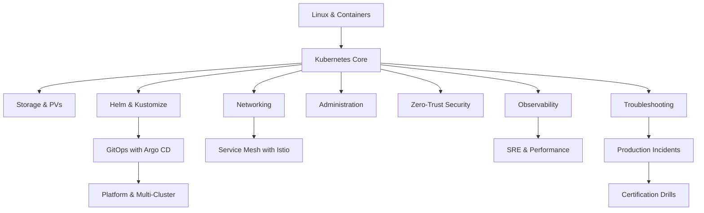

# KubeLab Curriculum

## Track Overview

| # | Track | Lessons | Labs | Difficulty | Prerequisites |
|---|---|---|---|---|---|
| 1 | Linux & Containers | 8 | 8 | Beginner | None |
| 2 | Kubernetes Core Architecture | 15 | 15 | Beginner | Track 1 |
| 3 | Storage & PVs | 8 | 8 | Beginner | Track 2 |
| 4 | Cloud-Native Networking | 13 | 13 | Intermediate | Track 2 |
| 5 | Helm & Kustomize | 8 | 8 | Intermediate | Track 2 |
| 6 | Cluster Administration | 12 | 12 | Intermediate | Track 2 |
| 7 | Zero-Trust Security | 13 | 13 | Intermediate | Track 2 |
| 8 | GitOps with Argo CD | 11 | 11 | Intermediate | Track 2, Track 5 |
| 9 | Service Mesh with Istio | 11 | 11 | Advanced | Track 4 |
| 10 | Observability & Telemetry | 10 | 10 | Advanced | Track 2 |
| 11 | Troubleshooting | 10 | 10 | Advanced | Track 2, Track 4 |
| 12 | SRE & Performance | 8 | 8 | Advanced | Track 9, Track 10 |
| 13 | Platform & Multi-Cluster | 7 | 7 | Expert | Tracks 7-10 |
| 14 | Production Incidents | 10 | 10 | Expert | Tracks 6-11 |
| 15 | Certification Drills | 10 | 10 | Mixed | All Tracks |

**Total: 154 labs across 15 tracks**

## Skill Graph (DAG)

## Certification Tracks

- **CKA (Certified Kubernetes Administrator)**: Tracks 2, 3, 4, 6, 11
- **CKAD (Certified Kubernetes Application Developer)**: Tracks 1, 2, 3, 5, 8
- **CKS (Certified Kubernetes Security Specialist)**: Tracks 1, 5, 7, 8, 9
- **KubeLab Master Certification**: Complete all 15 tracks + 10 incident scenarios + capstone drill
