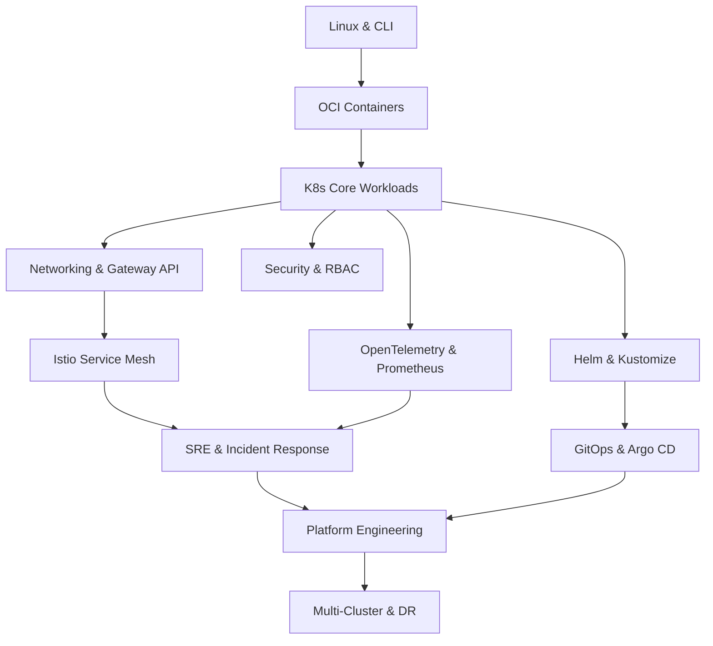

# KubeLab Curriculum

## Track Overview

| # | Track | Lessons | Labs | Difficulty | Prerequisites |
|---|---|---|---|---|---|
| 1 | Linux & CLI | 15 | 15 | Beginner | None |
| 2 | OCI Containers & Podman | 12 | 12 | Beginner | Track 1 |
| 3 | Kubernetes Core Workloads | 20 | 20 | Beginner | Track 2 |
| 4 | Networking & Gateway API | 14 | 14 | Intermediate | Track 3 |
| 5 | Security & RBAC Hardening | 15 | 15 | Intermediate | Track 3 |
| 6 | Helm & Kustomize | 10 | 10 | Intermediate | Track 3 |
| 7 | GitOps with Argo CD | 12 | 12 | Intermediate | Track 3, Track 6 |
| 8 | Istio Service Mesh | 12 | 12 | Advanced | Track 4 |
| 9 | OpenTelemetry & Prometheus | 15 | 15 | Advanced | Track 3 |
| 10 | SRE & Incident Response | 10 | 10 | Advanced | Track 8, Track 9 |
| 11 | Platform Engineering | 10 | 10 | Expert | Tracks 7-10 |
| 12 | Multi-Cluster & DR | 10 | 10 | Expert | Tracks 7-10 |

**Total: 145 labs across 12 tracks**

## Skill Graph (DAG)

## Learning Path: Beginner to Expert

### Phase 1: Foundations (Weeks 1-4)
- Linux & CLI: Shell scripting, file permissions, process management
- OCI Containers: Namespaces, cgroups, Podman, image builds

### Phase 2: Kubernetes Core (Weeks 5-10)
- Pods, Deployments, Services, ConfigMaps, Secrets
- StatefulSets, DaemonSets, Jobs, CronJobs
- Resource management, scheduling, storage

### Phase 3: Advanced Operations (Weeks 11-18)
- Networking: CNI, Services, Ingress, Gateway API
- Security: RBAC, PSA/PSS, NetworkPolicy, OPA
- Packaging: Helm charts, Kustomize overlays
- GitOps: Argo CD applications, sync policies, drift detection

### Phase 4: Expert (Weeks 19-26)
- Service Mesh: Istio, Envoy, traffic management, mTLS
- Observability: Distributed tracing, PromQL, Grafana dashboards
- SRE: SLI/SLO, incident response, postmortems
- Platform Engineering: Developer platforms, multi-tenancy
- Multi-Cluster: Federation, disaster recovery

## Grading Model

- Each lab awards XP based on difficulty (50-500 XP per lab)
- Skill levels: 1 (Novice) → 5 (Expert)
- Level thresholds: L1=0, L2=500, L3=1500, L4=3000, L5=5000 XP
- Badges awarded for track completion and special achievements
- Certifications available for completing full learning paths
