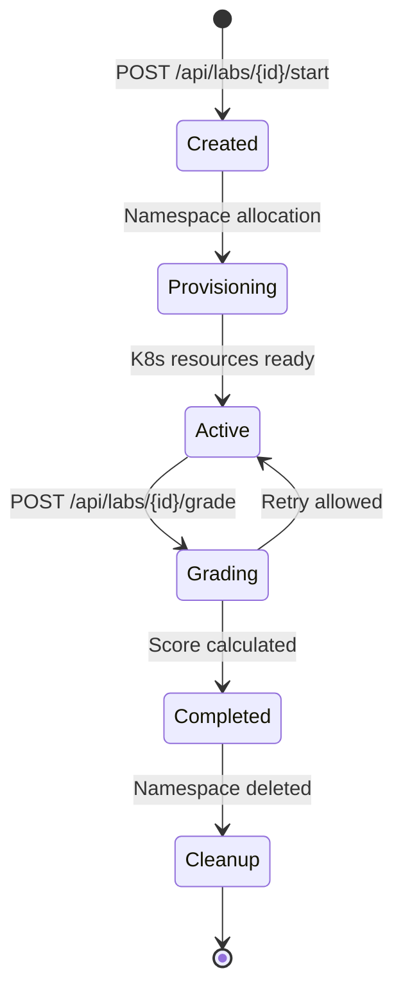

# KubeLab Lab Guide

## Lab Architecture

Each lab is defined as a YAML file in `labs/<track>/<lab-id>/lab.yaml` following the `DeclarativeLabDef` schema defined in `packages/validation-engine/src/models.rs`.

## Lab Schema

```yaml
id: "k8s-pod-basics"
title: "Create and Manage Pods"
track: "kubernetes-core"
difficulty: "beginner"
duration_minutes: 30
scenario: "Create a nginx pod and verify it's running"
tasks:
  - id: "create-pod"
    title: "Create an nginx Pod"
    points: 100
    instructions: "Create a pod named 'web' using nginx:latest image"
    hint: "Use kubectl run web --image=nginx:latest"
    solution: "kubectl run web --image=nginx:latest"
    validation:
      type: "kubernetes_state"
      assertions:
        - resource: "pod"
          name: "web"
          namespace: "{{session_namespace}}"
          field: "status.phase"
          operator: "equals"
          expected: "Running"
```

## Lab Lifecycle



## Sandbox Provisioning
- Dedicated Kubernetes namespace per session
- Pod Security Standards: `restricted` profile enforced
- LimitRange: CPU 500m/1000m, Memory 256Mi/512Mi defaults
- NetworkPolicy: IMDS metadata endpoint blocked
- Automatic cleanup on session end or timeout

## Validation & Grading
- **Operators**: `Equals`, `Contains`, `Exists`, `GreaterThan`, `LessThan`, `Regex`, `NotEquals`
- **JSONPath** queries against live Kubernetes API
- Path normalization: strips `$.` prefix for compatibility
- Score = sum of passing task points / total possible points
- No auto-pass: unavailable clusters return explicit `Unavailable` status

## Lab Categories
- **Standard labs**: Create/modify K8s resources, verify state
- **Debugging labs**: Find and fix broken deployments
- **Incident labs**: Respond to injected failures (DNS, crashloop, OOM)
- **GitOps labs**: Manage Argo CD applications and drift
- **Mesh labs**: Configure Istio routing and policies
