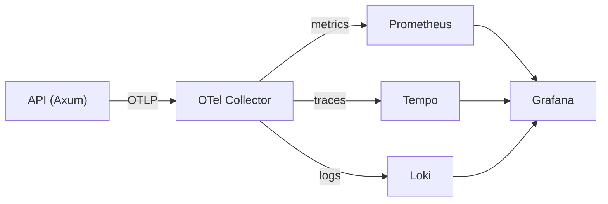

# KubeLab Observability

## Stack Overview



## Components

| Component | Port | Purpose |
|---|---|---|
| OTel Collector | 4317 (gRPC), 4318 (HTTP) | Telemetry ingestion and routing |
| Prometheus | 9090 | Metrics storage and querying |
| Tempo | 4317 | Distributed trace storage |
| Loki | 3100 | Log aggregation |
| Grafana | 3001 | Dashboards and visualization |

## Configuration

- OTel Collector config: `infrastructure/containers/otel-collector-config.yaml`
- Grafana datasources: `infrastructure/containers/grafana/provisioning/datasources/datasources.yaml`
- API telemetry setup: `services/api/src/telemetry.rs`
- API metrics endpoint: `services/api/src/metrics.rs` → `GET /metrics`

## Trace Correlation

Grafana datasources are configured with trace-to-log and trace-to-metric correlation:
- Click a trace span in Tempo → jump to related logs in Loki
- Click a metric in Prometheus → find related traces in Tempo

## Verification

```bash
./scripts/verify-observability.ps1  # Check all observability components
```
