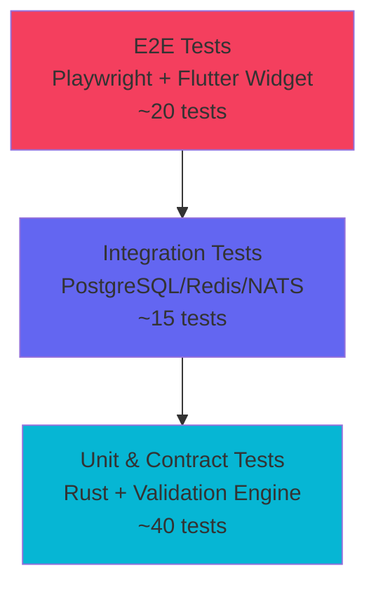

# KubeLab Testing

## Test Pyramid



## Coverage Thresholds

| Scope | Minimum | Target |
|---|---|---|
| Overall | 90% | ≥ 95% |
| Validator/Orchestrator/Security | 95% | ≥ 95% |
| Line/Branch/Function/Statement | Reported | All ≥ 90% |

## Test Suites

### Rust Unit Tests
```bash
cargo test --workspace --all-targets
```
Key test files:
- `services/api/tests/api_contract_test.rs` — API endpoint contracts
- `services/api/tests/terminal_isolation_test.rs` — WebSocket sandbox isolation
- `services/api/tests/cors_csrf_test.rs` — CORS header validation
- `services/api/tests/rate_limit_auth_test.rs` — Rate limiting behavior
- `services/auth/tests/auth_flow_test.rs` — Registration/login/JWT flow
- `packages/validation-engine/tests/` — Schema validation and grading

### Integration Tests (require backing services)
```bash
cargo test --workspace -- --ignored --nocapture
```
Requires: PostgreSQL, Redis, NATS running (CI provides these via service containers).

### Web E2E (Playwright)
```bash
cd apps/web
pnpm exec playwright install --with-deps chromium
pnpm exec playwright test
```
Test specs in `apps/web/e2e/`:
- `auth.spec.ts` — Registration/login flow
- Additional E2E specs for learning, labs, and terminal

### Mobile Tests (Flutter)
```bash
cd apps/mobile
flutter test --coverage
```
Tests in `apps/mobile/test/widget_test.dart`:
- App smoke test and tab navigation
- Lesson screen rendering
- Profile screen data display

### Lab Schema Validation
```bash
cargo run -p kubelab-validation-engine --bin validate_lab_schema -- --path labs/
```
Validates all 154 lab YAML definitions against the schema.

### Security Tests
```bash
cargo test -p kubelab-api --test security_adversarial_test
cargo test -p kubelab-api --test manifest_admission_test
cargo test -p kubelab-api --test terminal_isolation_test
cargo test -p kubelab-api --test cors_csrf_test
cargo test -p kubelab-api --test rate_limit_auth_test
```

### Coverage Generation
```bash
# Using cargo-tarpaulin (containerized)
./scripts/coverage.ps1   # Windows
./scripts/coverage.sh    # Linux/macOS
```

## CI Integration

All tests run automatically in the CI pipeline (`ci.yml`):
- `quality` job: `cargo fmt --check` + `cargo clippy -D warnings`
- `unit-tests` job: `cargo test --workspace`
- `integration` job: with PostgreSQL/Redis/NATS service containers
- `web` job: Playwright E2E
- `mobile-android` job: `flutter test --coverage`
- `labs` job: validation engine tests + schema validation
- `production-validation` job: 13-gate certification script

## Diagnosing Test Failures

1. **Check CI logs** for the specific failed job
2. **Reproduce locally**: run the exact `cargo test` or `flutter test` command
3. **For integration tests**: ensure backing services are running
4. **For Playwright**: check screenshots in `apps/web/test-results/`
5. **For mobile**: check `flutter analyze` output for deprecation warnings
